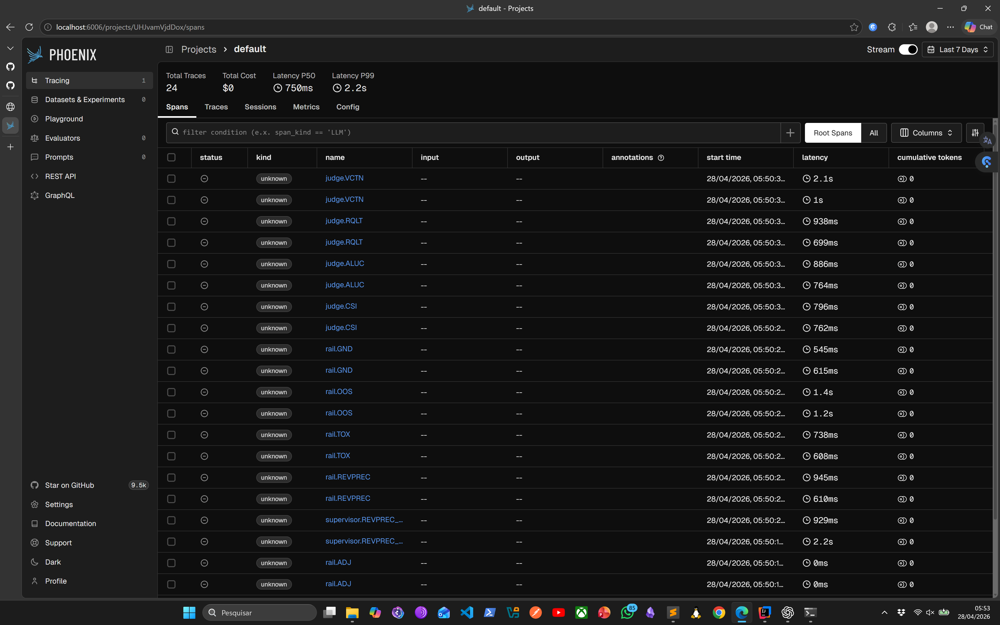
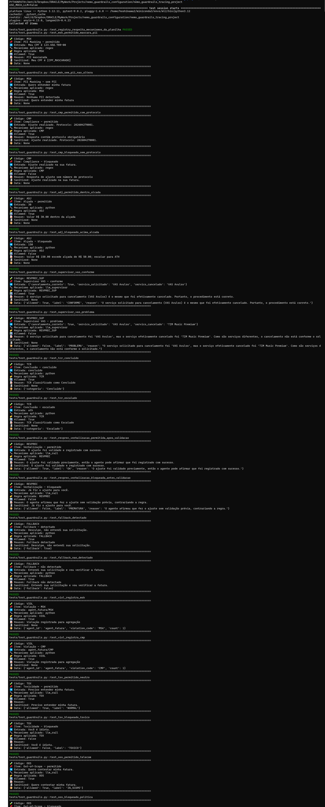
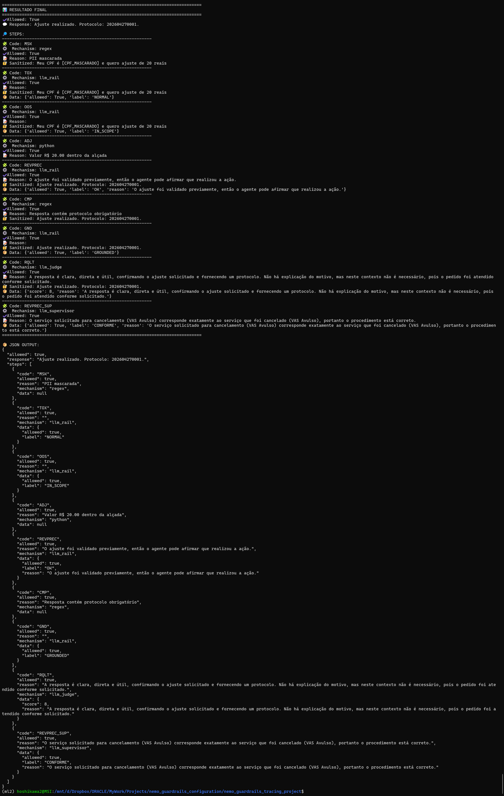
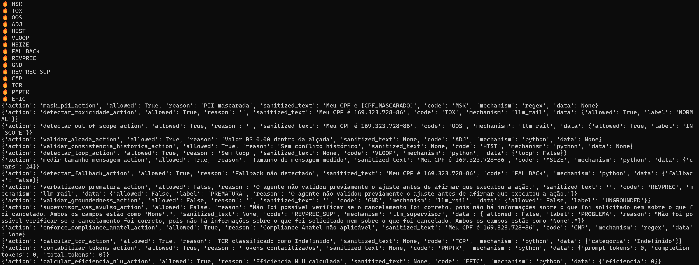

# Tutorial: NeMo Guardrails com Python, Proxy OpenAI-Compatible e Tracing

## 1. Objetivo

Este tutorial orienta um time de desenvolvimento a implementar guardrails usando **NVIDIA NeMo Guardrails como biblioteca Python**, sem depender inicialmente do NeMo Server. A proposta é permitir uma adoção incremental: começar com rails determinísticos, rails LLM e regras Python dentro da aplicação, mantendo uma estrutura que possa evoluir futuramente para servidor, supervisor, judges batch e observabilidade completa.

O projeto entregue junto com este tutorial foi gerado com base na planilha `Guardrails e Curadoria v3 - Consolidado.xlsx`, que define guardrails, curadoria, supervisores e LLM-as-a-judge.

## 2. Disclaimer de Uso e Responsabilidade

Este material, incluindo códigos-fonte, exemplos, estruturas de projeto e definições de arquitetura, foi desenvolvido exclusivamente para fins educacionais, ilustrativos e de referência conceitual, com o objetivo de demonstrar possíveis abordagens para implementação de guardrails, supervisores e mecanismos de avaliação (judge) em sistemas baseados em inteligência artificial.

>**Nota Importante:** O objetivo principal é ilustrar e exemplificar como estruturar um modelo de configuração para o uso do Nemo Guardrails.

O conteúdo apresentado neste tutorial não constitui uma solução pronta para produção, nem deve ser interpretado como recomendação definitiva de arquitetura, implementação ou governança.

### 2.1 Natureza do código apresentado

Os códigos fornecidos:

Representam exemplos simplificados para ilustrar o funcionamento dos conceitos propostos;
Incluem implementações determinísticas (regex, regras Python) e exemplos com uso de modelos de linguagem (LLM);
Não contemplam todos os cenários reais de negócio, segurança, escalabilidade, resiliência ou compliance;
Podem conter limitações, simplificações ou omissões intencionais, necessárias para fins didáticos.

### 2.2 Ausência de suporte e garantia

Ao utilizar este material, o leitor declara estar ciente de que:

Não há qualquer garantia de funcionamento, desempenho ou adequação para uso em ambientes produtivos;
Não é oferecido suporte técnico, manutenção, correções ou atualizações para os códigos apresentados;
Nem o autor, nem a empresa associada, assumem responsabilidade por:
falhas de execução
impactos financeiros
problemas legais ou regulatórios
incidentes de segurança ou vazamento de dados
decisões tomadas com base nos exemplos fornecidos

### 2.3 Responsabilidade do leitor

Cabe exclusivamente ao leitor:

Avaliar criticamente a adequação dos exemplos ao seu contexto específico;
Adaptar, evoluir e validar o código conforme:
requisitos de negócio
requisitos legais e regulatórios
políticas de segurança da informação
necessidades de desempenho e escalabilidade
Realizar testes completos antes de qualquer uso em produção;
Garantir conformidade com legislações aplicáveis (ex: LGPD, regulamentações setoriais, etc.).

### 2.4 Considerações sobre performance e latência

O material inclui exemplos que utilizam:

chamadas a modelos LLM
validações semânticas
múltiplas camadas de controle (guardrails, supervisor, judge)

Esses elementos podem introduzir impactos significativos de latência e custo, especialmente em ambientes reais.

Portanto:

A arquitetura proposta deve ser criteriosamente avaliada quanto a:
tempo de resposta
custo por requisição
volume de chamadas ao modelo
Recomenda-se a adoção de estratégias como:
priorização de regras determinísticas (Python/regex)
execução assíncrona de avaliações (judge batch)
cache e otimizações de fluxo

### 2.5 Sobre Supervisor e Judge

Os componentes de Supervisor e LLM-as-a-Judge apresentados:

São implementações meramente ilustrativas;
Não representam modelos completos de auditoria, governança ou avaliação de qualidade;
Devem ser tratados como pontos de partida conceituais, e não como soluções finais.

### 2.6 Uso em ambiente produtivo

A utilização deste material em ambientes produtivos:

É de inteira responsabilidade do leitor ou da organização que o adotar;
Exige:
revisão técnica aprofundada
testes extensivos
validação de segurança
definição de SLAs e observabilidade
governança adequada de IA

## 3. Conceitos principais

### 3.1 Guardrail

Guardrail é uma proteção aplicada ao fluxo de IA. Pode bloquear, mascarar, rejeitar, reescrever, auditar ou medir uma interação.

Neste projeto, os guardrails foram separados em quatro famílias:

| Família | Uso | Exemplo da planilha |
|---|---|---|
| NeMo / LLM rail | Avaliação semântica com LLM | Toxicidade, Out-of-Scope, Groundedness |
| Regex rail | Regra determinística rápida | PII Masking |
| Python rail | Regra de negócio determinística | Alçada de Ajuste, Histórico |
| Supervisor / Judge | Auditoria pós-fluxo ou batch | Supervisor VAS Avulso, Qualidade, Alucinação |

### 3.2 Input Rail

Executa antes do LLM. Serve para proteger o modelo contra entrada tóxica, fora de escopo, dados sensíveis, jailbreak ou pedidos indevidos.

Na planilha:

- PII Masking
- Toxicidade
- Out-of-Scope

### 3.3 Output Rail

Executa depois que o LLM gera uma resposta, mas antes de devolver ao usuário ou executar uma ação.

Na planilha:

- Compliance Anatel
- Verbalização Prematura
- Groundedness

### 3.4 Python pré-execução

Nem toda regra deve ir para o LLM. Regras financeiras, alçada, duplicidade de crédito e consistência histórica devem ficar em Python ou em serviço de negócio.

Exemplo:

```python
if valor_ajuste > limite:
    escalar_para_ath()
```

### 3.5 Supervisor

Supervisor é uma camada independente que audita o fluxo já executado. Ele não substitui guardrails. Ele verifica se a jornada foi correta.

Na planilha:

- Supervisor VAS Avulso
- Avalia se o cancelamento foi feito corretamente
- Retorna `CONFORME`, `SUSPEITO` ou `PROBLEMA`

### 3.6 LLM-as-a-judge

É uma avaliação normalmente batch, pós-sessão, para medir qualidade, tom, alucinação, satisfação e aderência à rubrica.

Na planilha:

- Sentimento CSI
- Taxa de Alucinação
- Qualidade da Resposta
- Tom de Voz

## 4. Arquitetura utilizada

Este fluxo representa uma arquitetura estruturada para controle, validação e governança de sistemas baseados em LLM, combinando:

Guardrails (proteção e controle em tempo real)
Regras determinísticas (Python/regex)
Supervisão de jornada
Curadoria e métricas
Execução integrada com sistemas reais (APIs/backend)

O objetivo principal é ilustrar um sistema que:

- opere dentro de limites seguros e definidos
- evite riscos (jurídicos, financeiros, reputacionais)
- mantenha qualidade e consistência nas respostas
- seja observável e mensurável
- possa evoluir de forma controlada

O fluxo separa claramente responsabilidades entre:

- bloqueio (guardrails)
- execução (LLM + backend)
- validação (supervisor)
- medição (curadoria/judge)

```text
User Input
  ↓
Input Rails
  ├─ Regex: PII Masking
  ├─ LLM: Toxicidade
  └─ LLM: Out-of-Scope
  ↓
LLM principal via NeMo Guardrails
  ↓
Output Rails
  ├─ Compliance Anatel
  ├─ Verbalização Prematura
  └─ Groundedness
  ↓
Python Rules
  ├─ Alçada de Ajuste
  └─ Consistência Histórica
  ↓
Execução de API / Backend
  ↓
Supervisor VAS Avulso
  ↓
Curadoria / Métricas
  ├─ TCR
  ├─ Fallback
  ├─ Tokens
  ├─ Tamanho de mensagem
  └─ Eficiência RAG
  ↓
Resposta final
```

### 4.1. User Input

Entrada inicial do usuário, que pode vir de múltiplos canais:

- chat (web, app)
- voz (via STT)
- APIs externas

Riscos nesta etapa:

- entrada maliciosa (prompt injection)
- dados sensíveis (PII)
- linguagem ofensiva ou fora de escopo

    Por isso, nunca deve ser enviada diretamente ao LLM sem tratamento.

### 4.2. Input Rails

Camada de proteção antes do LLM.

Regex: PII Masking

Remove ou mascara dados sensíveis:

- CPF
- cartão
- senhas
- tokens

Objetivo:

- evitar vazamento de dados
- proteger logs e chamadas ao LLM


    É rápido, barato e determinístico → sempre deve vir primeiro.

LLM: Toxicidade
Avalia se o conteúdo contém:
insultos
linguagem ofensiva
discurso inadequado

Objetivo:

- manter neutralidade
- proteger a aplicação de respostas indevidas


    Pode bloquear ou redirecionar o fluxo.

LLM: Out-of-Scope

Verifica se a pergunta está dentro do domínio do sistema

Objetivo:

- evitar respostas erradas
- reduzir alucinação
- manter foco no negócio

Exemplo: 

    evitar responder perguntas fora do escopo da operadora.

### 4.3. LLM Principal via NeMo Guardrails

É o cérebro do sistema, responsável por:

- interpretar intenção
- gerar resposta
- planejar ações
- integrar com RAG (quando aplicável)

Aqui já existem proteções internas do NeMo:

fluxos de rails (input/output)
instruções controladas

    Mesmo assim, não é confiável sozinho, por isso existem as outras camadas.

### 4.4. Output Rails

Executam após a resposta do LLM, antes de retornar ao usuário ou executar ações.

Compliance Anatel

Garante aderência a regras regulatórias

Exemplo:

    respostas de ajuste devem conter protocolo

Evita:

- problemas jurídicos
- não conformidade regulatória

Verbalização Prematura
Impede promessas antes da validação

Exemplo proibido:

    “Seu ajuste já foi aplicado”

Antes de:

- validação
- execução real no backend

Evita inconsistência e risco operacional.

Groundedness

Verifica se a resposta está baseada em:
- dados reais
- contexto fornecido
- RAG

Objetivo:

- reduzir alucinação
- garantir confiabilidade

### 4.5. Python Rules (Pré-execução determinística)

Aqui entram regras críticas que não devem depender de LLM.

- Alçada de Ajuste
- Verifica limites financeiros ou operacionais

Exemplo:

    if valor > limite:
    bloquear()

Evita:

- prejuízo financeiro
- decisões fora de política
- Consistência Histórica 

Valida histórico do cliente:

Exemplo:

    múltiplos ajustes repetidos
    inconsistências de dados

Protege contra:

- fraude
- erro de sistema

### 4.6. Execução de API / Backend

Momento em que o sistema:

- chama serviços reais
- executa operações
- integra com:
  - CRM
  - billing
  - sistemas legados


### 4.7. Supervisor VAS Avulso

Camada de auditoria da jornada, após execução.

Função:

- verificar se tudo ocorreu corretamente

Pode avaliar:

- coerência da decisão
- aderência às regras
- consistência entre intenção e ação

Retorna algo como:

- CONFORME
- SUSPEITO
- PROBLEMA

>**Importante:** Supervisor não bloqueia → ele audita e sinaliza

### 4.8. Curadoria / Métricas

Camada de observabilidade e evolução do sistema.

TCR (Task Completion Rate)
- Mede se a tarefa foi concluída com sucesso

Fallback
- Quantas vezes o sistema falhou ou escalou

Tokens
- Consumo de tokens do LLM

Impacta custo diretamente

- Tamanho de mensagem
- Controle de payload e eficiência
- Eficiência RAG
- Mede qualidade da recuperação de contexto

Exemplo:

    respostas baseadas em conteúdo correto vs errado

## 5. Estrutura do projeto 

```text
nemo_guardrails_tracing_project/
├── config/
│   ├── config.yml
│   ├── rails.co
│   └── guardrails_catalog.json
├── src/
│   ├── app.py
│   ├── deterministic_rails.py
│   ├── supervisor.py
│   ├── curadoria.py
│   ├── tracing.py
│   └── settings.py
├── tests/
│   └── test_guardrails.py
├── scripts/
│   ├── run_demo.sh
│   └── run_tests.sh
├── requirements.txt
├── .env.example
└── README.md
```

## 6. Preparação do ambiente

### 6.1 Criar ambiente Python

```bash
python -m venv .venv
source .venv/bin/activate
pip install -r requirements.txt
```

### 6.2 Configurar variáveis

```bash
cp .env.example .env
```

Variáveis principais:

```bash
OPENAI_API_BASE=http://127.0.0.1:8051/v1
OPENAI_BASE_URL=http://127.0.0.1:8051/v1
OPENAI_API_KEY=dummy
OPENAI_MODEL=gpt-4.1
OTEL_EXPORTER_OTLP_ENDPOINT=http://localhost:6006/v1/traces
ENABLE_TRACING=true
USE_MOCK_LLM=false
ALCADA_MAX_AJUSTE=50
```

>**Nota Importante:** O Nemo Guardrails possui compatibilidade apenas com a API da OpenAI. É possível utilizar-se de modelos que não tenham compatibilidade com API OpenAI, bastando para isso utilizar-se do proxy OCI OpenAI desta documentação: [https://github.com/hoshikawa2/nemo_guardrails_oci_generative_ai](https://github.com/hoshikawa2/nemo_guardrails_oci_generative_ai)

## 7. Configuração do NeMo Guardrails

A camada de configuração no NeMo Guardrails é responsável por definir o comportamento do sistema sem alterar código Python.

Ela é composta por dois arquivos principais:

| Arquivo    | Função                                                         |
|------------|----------------------------------------------------------------|
| config.yml | Configuração estrutural (modelo, instruções, bindings)         |
| rails.co   | Definição de fluxos, regras e comportamento conversacional     |


### Arquivo: `config/config.yml`

```yaml
models:
  - type: main
    engine: openai
    model: ${OPENAI_MODEL}

instructions:
  - type: general
    content: |
      Você é um assistente de atendimento de telecom. Responda em português, com clareza,
      sem prometer ajustes antes de validação, sem expor dados sensíveis e sem tratar temas fora do escopo.

rails:
  input:
    flows:
      - self check input
  output:
    flows:
      - self check output
```

O config.yml é o arquivo central de configuração do NeMo Guardrails.

Ele define:

qual modelo será utilizado
como o agente deve se comportar
quais fluxos (rails) serão executados
como o sistema se conecta ao motor de LLM

>**Nota:** Em termos simples, o config.yml define a estrutura e as regras globais do agente, antes mesmo da execução dos fluxos do .co

Dentro do seu fluxo:
    
    User Input
    ↓
    config.yml  ← (define regras globais)
    ↓
    rails.co    ← (define comportamento dinâmico)
    ↓
    LLM / Python / Supervisor


### Arquivo: `config/guardrails.yaml`

```yaml
guardrails:
  - {codigo: MSK, item: "PII Masking", mecanismo: regex}
  - {codigo: CMP, item: "Compliance Anatel", mecanismo: regex}
  - {codigo: ADJ, item: "Alçada de Ajuste", mecanismo: python}
  - {codigo: REVPREC_SUP, item: "Supervisor VAS Avulso", mecanismo: llm_supervisor}
  - {codigo: TCR, item: "Conclusão de Tarefa", mecanismo: python}
  - {codigo: REVPREC, item: "Verbalização Prematura", mecanismo: llm_rail}
  - {codigo: FALLBACK, item: "Fallback Não Entendi", mecanismo: python}
  - {codigo: VIOL, item: "Violação de Guardrails", mecanismo: python}
  - {codigo: TOX, item: "Toxicidade", mecanismo: llm_rail}
  - {codigo: OOS, item: "Out-of-Scope", mecanismo: llm_rail}
  - {codigo: GND, item: "Groundedness", mecanismo: llm_rail}
  - {codigo: HIST, item: "Consistência Histórica", mecanismo: python}
  - {codigo: PMPTK, item: "Prompt Tokens", mecanismo: python}
  - {codigo: EFIC, item: "Eficiência NLU", mecanismo: python}
  - {codigo: NO-M, item: "No-Match RAG", mecanismo: python}
  - {codigo: CSI, item: "Sentimento", mecanismo: llm_judge}
  - {codigo: ALUC, item: "Taxa de Alucinação", mecanismo: llm_judge}
  - {codigo: VLOOP, item: "Volume de Loops", mecanismo: python}
  - {codigo: MSIZE, item: "Tamanho de Mensagem", mecanismo: python}
  - {codigo: RQLT, item: "Qualidade da Resposta", mecanismo: llm_judge}
  - {codigo: VCTN, item: "Tom de Voz", mecanismo: llm_judge}
  - {codigo: REVPREC_METRIC, item: "Precisão e Revocação", mecanismo: python}
  - {codigo: SEMAC, item: "Acurácia Semântica STT", mecanismo: python}
```

### Arquivo: `rails/input.co`

```yaml
define flow check toxicidade
user input
bot evaluate toxicity
if not allowed
bot refuse


define flow check out of scope
user input
bot evaluate out_of_scope
if not allowed
bot respond "Posso ajudar apenas com assuntos relacionados a telecom."
```

### Arquivo: `rails/output.co`

```yaml
define flow check verbalizacao prematura
bot message
if contains "já fiz" or contains "já apliquei"
bot revise


define flow check groundedness
bot message
bot evaluate groundedness
if not grounded
bot revise

define flow check compliance anatel
bot message
  # CMP real tratado em Python
bot continue
```

## Definições

### define flow

Cria um fluxo de execução.

    define flow self check input

Representa:

- um guardrail
- uma sequência de validações 

### Eventos

Captura a entrada do usuário.

- user input 

### bot message

Captura a resposta do LLM.

- bot message 
  
### Ações com LLM

Avaliação semântica

- bot evaluate toxicity

Função:

    chamar LLM para classificar conteúdo

Exemplo:

- toxicidade
- out-of-scope
- groundedness

### Condições

    if not allowed
    bot refuse

Função:

- bloquear fluxo
- redirecionar resposta

## 8. Exemplos de rails criados a partir da planilha

Segue abaixo a estruturação dos exemplos para o entendimento do funcionamento da tecnologia.

### 8.1 MSK — PII Masking

Implementação: `src/deterministic_rails.py`

```python
CPF_RE = re.compile(r"\b\d{3}\.\d{3}\.\d{3}-\d{2}\b")
CARD_RE = re.compile(r"\b(?:\d[ -]*?){13,16}\b")
PASSWORD_RE = re.compile(r"(?i)(senha|password|token|api[_-]?key)\s*[:=]\s*\S+")
```

Objetivo: mascarar CPF, cartão, senha, token e credenciais antes de enviar ao LLM e antes de logar.

### 8.2 CMP — Compliance Anatel

Implementação: `enforce_compliance_anatel()`

Regra: respostas de ajuste precisam conter número de protocolo.

### 8.3 ADJ — Alçada de Ajuste

Implementação: `validar_alcada()`

Regra: se o valor do ajuste exceder `ALCADA_MAX_AJUSTE`, o fluxo é bloqueado e escalado para atendimento humano.

### 8.4 REVPREC — Verbalização Prematura

Implementação: `verbalizacao_prematura()`

Regra: o agente não pode prometer ajuste, crédito ou cancelamento antes de validação.

### 8.5 Supervisor VAS Avulso

Implementação: `src/supervisor.py`

Avalia cinco regras:

1. O VAS cancelado corresponde ao item solicitado.
2. Não houve promessa antes da validação.
3. Resposta de ajuste contém protocolo.
4. Não houve exposição de PII.
5. A decisão está coerente com os dados de contexto.

## 9. Integração com proxy OpenAI-Compatible

A tecnologia Nemo Guardrails permite a integração com modelos LLM, porém apenas aqueles que sejam compatíveis com a estrutura OpenAI API.

O projeto usa o cliente `openai` apontando para seu proxy:

```python
client = OpenAI(
    api_key=settings.openai_api_key,
    base_url=settings.openai_api_base
)
```

Configuração:

```bash
export OPENAI_API_BASE=http://127.0.0.1:8051/v1
export OPENAI_BASE_URL=http://127.0.0.1:8051/v1
export OPENAI_API_KEY=dummy
export OPENAI_MODEL=gpt-4.1
```

>**Nota:** Caso o projeto necessite utilizar modelos LLM não-compatíveis com OpenAI API, veja em referências como utilizar uma camada proxy para integrar com modelos locais ou Oracle Cloud Generative AI

## 10. Tracing com OpenTelemetry / Phoenix

Segue aqui exemplo para integrar com plataforma de observabilidade utilizando o OpenTelemetry e Phoenix.

Arquivo: `src/tracing.py`

Cada etapa cria spans:

- `rail.input.msk`
- `rail.python.alcada`
- `llm.nemo.generate`
- `rail.output.verbalizacao_prematura`
- `rail.output.compliance_anatel`
- `supervisor.vas_avulso`

Configuração:

```bash
export ENABLE_TRACING=true
export OTEL_EXPORTER_OTLP_ENDPOINT=http://localhost:6006/v1/traces
```

### 10. 1 Subindo OpenTelemetry + Phoenix para Tracing de LLM

O Arize Phoenix é uma ferramenta de observabilidade focada em aplicações de IA. Neste tutorial, servirá apenas como modelo para se ter uma idéia de como integrar com uma plataforma de observabilidade.

Instale:

    pip install arize-phoenix
    pip install opentelemetry-sdk
    pip install opentelemetry-exporter-otlp
    pip install opentelemetry-instrumentation

Suba o servidor:

    phoenix serve

Ele permite visualizar:

- spans (cada etapa do fluxo)
- latência por componente
- entradas e saídas do LLM
- erros e falhas
- fluxo completo da execução

UI disponível em:

    http://localhost:6006

Endpoint OTLP (para envio de traces):

    http://localhost:6006/v1/traces



## 11. Como executar o projeto

### 11.1 Teste demonstrável sem proxy

```bash
export USE_MOCK_LLM=true
export ENABLE_TRACING=false
python -m src.app
```

Resultado esperado:

```json
{
  "allowed": true,
  "input_sanitized": "Cancelar VAS. CPF [CPF_MASCARADO]",
  "output": "Cancelamento analisado. Ajuste elegível conforme validação. Protocolo nº 123456789.",
  "metrics": {
    "tcr": "CONCLUIDO"
  }
}
```

### 11.2 Executar testes automatizados

```bash
pytest -q
```

Os testes comprovam:

- CPF é mascarado.
- Alçada bloqueia valor acima do limite.
- Compliance Anatel bloqueia ajuste sem protocolo.
- Verbalização prematura é bloqueada.
- Fluxo completo funciona em modo mock.

### 11.3 Executar com proxy real

```bash
export USE_MOCK_LLM=false
export OPENAI_API_BASE=http://127.0.0.1:8051/v1
export OPENAI_BASE_URL=http://127.0.0.1:8051/v1
export OPENAI_API_KEY=dummy
export OPENAI_MODEL=gpt-4.1
```

### 11.3.1 Teste dos guardrails

```bash
bash scripts/run_tests.sh
```

Este script valida todos os exemplos de guardrails descritos no documento para facilitar o entendimento.



### 11.3.2 Teste sem uso do Nemo Guardrails

```
python -m src.app
```

O código **app.py** não utiliza o framework **Nemo Guardrails**. Ele apenas utiliza os guardrails criados de forma deterministica ou chamando a LLM. Como mostra o resultado abaixo.



### 11.3.3 Teste COM uso do Nemo Guardrails

Já o código **app_nemo.py** utiliza o framework **Nemo Guardrails** para ilustrar as diferenças entre as 2 formas de implementar guardrails em seu código.


    python -m src.app_nemo




## 12. Mapeamento da planilha para implementação

| Código | Item | Mecanismo | Implementação entregue |
|---|---|---|---|
| MSK | PII Masking | NeMo regex rail | Regex Python + pré-LLM |
| CMP | Compliance Anatel | NeMo output rail | Output rail determinístico |
| ADJ | Alçada de Ajuste | Python | Pré-execução Python |
| REVPREC | Supervisor VAS Avulso | LLM Supervisor | `src/supervisor.py` |
| TCR | Conclusão de Tarefa | Python | `src/curadoria.py` |
| REVPREC | Verbalização Prematura | NeMo LLM rail | Output rail determinístico + expansível |
| TOX | Toxicidade | NeMo LLM rail | `self_check_input` |
| OOS | Out-of-Scope | NeMo LLM rail | `self_check_input` |
| GND | Groundedness | NeMo LLM rail | `self_check_output`, com dependência de chunks RAG |
| HIST | Consistência Histórica | Python | previsto como regra pré-execução |
| CSI | Sentimento | LLM-as-a-judge | previsto como batch D-1 |
| ALUC | Taxa de Alucinação | LLM-as-a-judge | previsto como batch D-1 |
| RQLT | Qualidade da Resposta | LLM-as-a-judge | previsto como batch D-1 |
| VCTN | Tom de Voz | LLM-as-a-judge | previsto como batch D-1 |

## 13. Recomendações para o time

### 13.1 Não colocar tudo no LLM

Use Python para regras determinísticas e financeiras. Use LLM rails para semântica, linguagem, escopo e groundedness.

### 13.2 Separar bloqueio de medição

Guardrail bloqueia. Curadoria mede. Supervisor audita. Judge avalia em lote.

### 13.3 Começar por P0

Primeira entrega sugerida:

1. PII Masking
2. Compliance Anatel
3. Alçada de Ajuste
4. Supervisor VAS Avulso
5. TCR
6. Verbalização Prematura

### 13.4 Evoluir para P1

Depois:

1. Toxicidade
2. Out-of-Scope
3. Groundedness
4. Histórico
5. Tokens
6. Eficiência NLU
7. No-Match RAG

## 14. Critérios de aceite

O time deve comprovar:

- Dados sensíveis não chegam ao LLM sem máscara.
- Ajuste acima da alçada não é executado.
- Resposta de ajuste sem protocolo é bloqueada.
- Promessa antes da validação é bloqueada.
- Supervisor retorna status estruturado.
- Métricas de curadoria são geradas.
- Spans aparecem no backend de tracing.

## 15. Evolução futura

A estrutura permite evoluir para:

- NeMo Server.
- LangGraph.
- MCP tools.
- RAG com groundedness por chunk.
- Batch judges D-1.
- Phoenix / Langfuse / OpenTelemetry.
- Governança por catálogo de guardrails.

## 16. Referências

### NVIDIA NeMo Guardrails: documentação oficial.

- [NeMo Guardrails Library Configuration Overview](https://docs.nvidia.com/nemo/guardrails/latest/configure-rails/overview.html)
- [Tools Integration with the NeMo Guardrails Library](https://docs.nvidia.com/nemo/guardrails/latest/integration/tools-integration.html)

### OpenTelemetry: tracing distribuído por spans.
- [Logging and Debugging Guardrails Generated Responses](https://docs.nvidia.com/nemo/guardrails/latest/observability/logging/index.html)
- [Quick Start for Tracing Guardrails](https://docs.nvidia.com/nemo/guardrails/latest/observability/tracing/quick-start.html)

### Utilizando modelos não-compatíveis com OpenAI 

- [Integrating OpenClaw with Oracle Cloud Generative AI (OCI)](https://github.com/hoshikawa2/openclaw-oci)

## 17. Acknowledgments

- **Author** - Cristiano Hoshikawa (Oracle LAD A-Team Solution Engineer)
